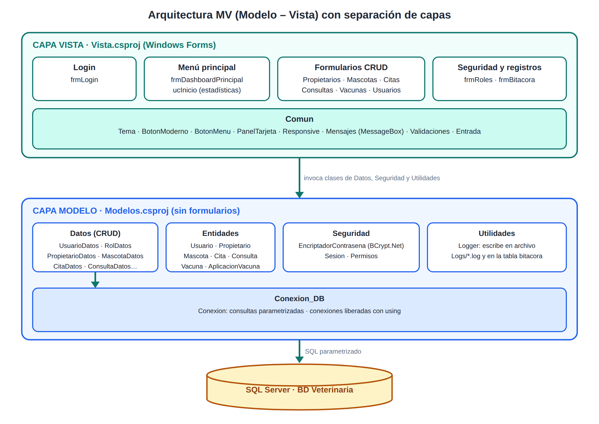
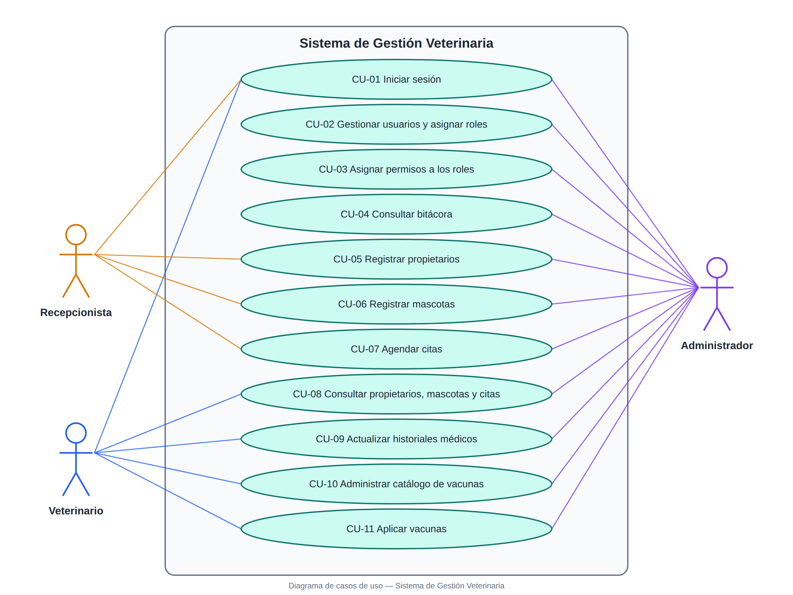
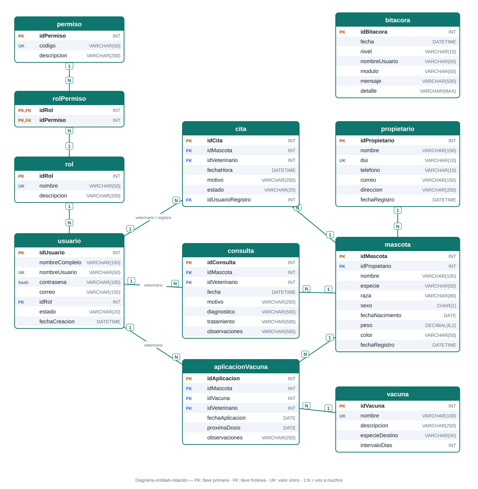
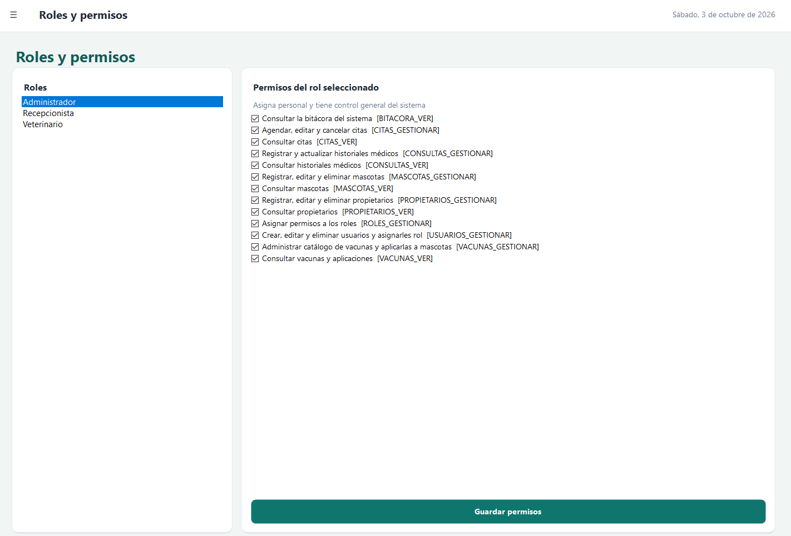
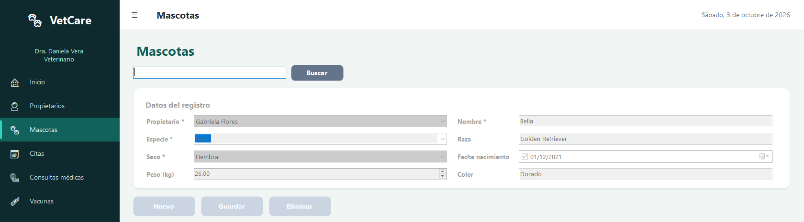
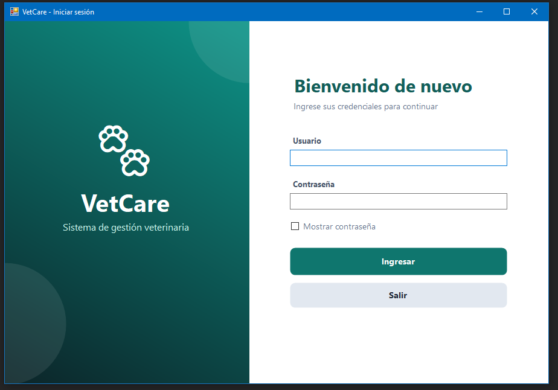
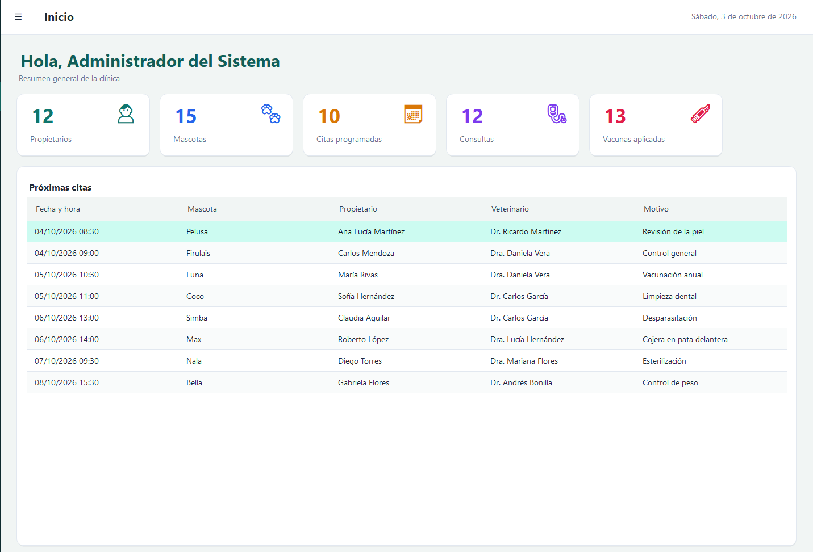
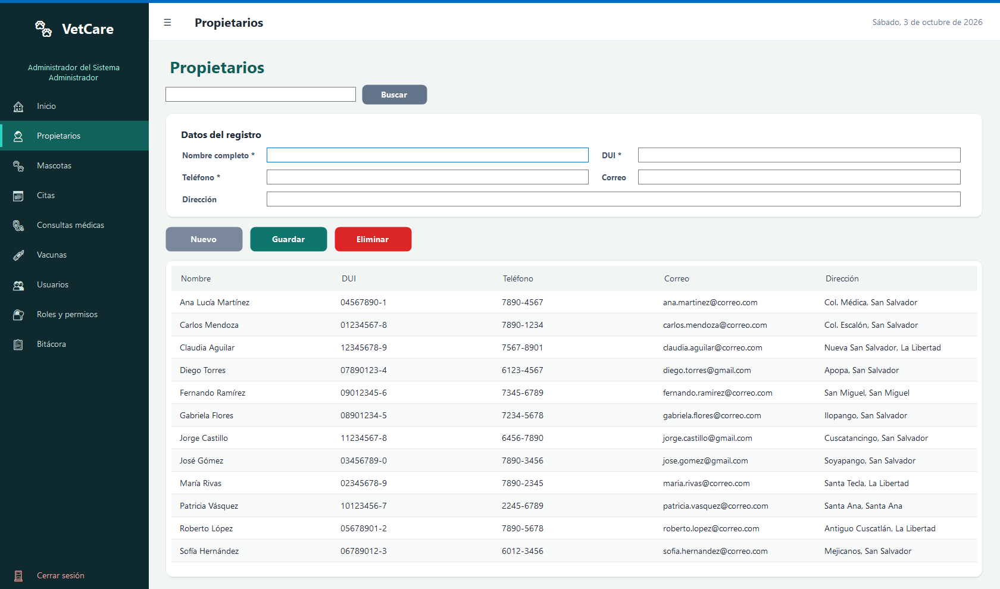
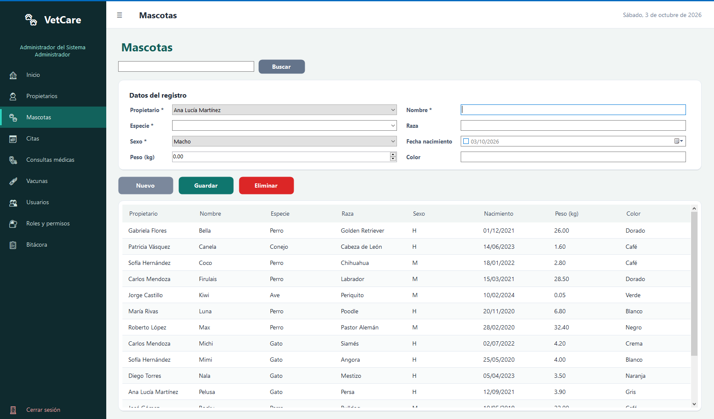
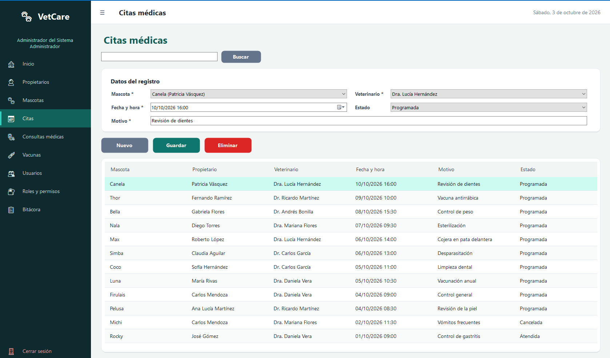

# INSTITUTO TÉCNICO RICALDONE

**Primer Año de Bachillerato, Desarrollo de Software**
**BTVDS-1.3 Diseño de Aplicaciones Multimedia**

---

## PROYECTO DE MÓDULO
## Sistema de Gestión Veterinaria

**Problema 5 — Clínica veterinaria**

Instructor: Emerson González

Integrantes:
1. ______________________________
2. ______________________________
3. ______________________________

Sección técnica: __________  ·  Fecha de entrega: 02/10/2026

## Índice

1. [Introducción](#1-introducción)
2. [Levantamiento de requerimientos](#2-levantamiento-de-requerimientos)
3. [Arquitectura del sistema](#3-arquitectura-del-sistema)
4. [Diagrama de casos de uso](#4-diagrama-de-casos-de-uso)
5. [Diagrama entidad–relación](#5-diagrama-entidadrelación)
6. [Diccionario de datos](#6-diccionario-de-datos)
7. [Seguridad y manejo de excepciones](#7-seguridad-y-manejo-de-excepciones)
8. [Cumplimiento de la rúbrica](#8-cumplimiento-de-la-rúbrica)
9. [Manual rápido de uso](#9-manual-rápido-de-uso)

---

## 1. Introducción

Una clínica veterinaria necesita organizar los expedientes de mascotas, vacunas, propietarios y citas médicas
para optimizar la atención y reemplazar el uso desordenado de archivos físicos.

El **Sistema de Gestión Veterinaria** es una aplicación de escritorio desarrollada en **C# (Windows Forms,
.NET Framework 4.8)** con base de datos **SQL Server**. Aplica una arquitectura **MV (Modelo–Vista)** con
separación de capas, autenticación con contraseñas cifradas mediante **BCrypt.Net**, control de acceso por
**roles y permisos** (Administrador, Veterinario y Recepcionista), operaciones **CRUD** completas, validaciones
de datos, manejo de excepciones con `try/catch` y `MessageBox`, y registro de actividades (*logging*) en archivo
y en la tabla `bitacora`.

La interfaz se construyó con Windows Forms (Microsoft, s. f.-a), los datos se almacenan en SQL Server (Microsoft, s. f.-b) y las contraseñas se protegen con BCrypt, un algoritmo de hash adaptativo diseñado para resistir ataques de fuerza bruta (Provos y Mazières, 1999), mediante la librería BCrypt.Net-Next (BcryptNet, s. f.). Los requisitos del proyecto provienen de la rúbrica de evaluación del módulo (Instituto Técnico Ricaldone, 2026).

**Objetivo general:** digitalizar y centralizar la información clínica de la veterinaria.

**Objetivos específicos:**

- Registrar propietarios y mascotas evitando duplicidad de datos.
- Agendar citas sin conflictos de horario para el veterinario.
- Mantener el historial médico y el control de vacunación de cada mascota.
- Controlar quién puede ver o modificar cada información según su rol.

## 2. Levantamiento de requerimientos

### 2.1 Requerimientos funcionales

La Tabla 1 resume los requerimientos funcionales identificados para el sistema.

| Código | Requerimiento | Rol principal |
|--------|---------------|---------------|
| RF-01 | Iniciar y cerrar sesión validando usuario y contraseña (BCrypt) | Todos |
| RF-02 | CRUD de usuarios con asignación de rol | Administrador |
| RF-03 | Asignar permisos a cada rol desde el sistema | Administrador |
| RF-04 | Consultar la bitácora de actividades y errores | Administrador |
| RF-05 | CRUD de propietarios | Recepcionista, Administrador |
| RF-06 | CRUD de mascotas asociadas a un propietario | Recepcionista, Administrador |
| RF-07 | Agendar, modificar, cancelar y eliminar citas | Recepcionista, Administrador |
| RF-08 | Registrar y actualizar historiales médicos (consultas) | Veterinario, Administrador |
| RF-09 | Administrar el catálogo de vacunas (CRUD) | Veterinario, Administrador |
| RF-10 | Aplicar vacunas a mascotas y calcular próxima dosis | Veterinario, Administrador |
| RF-11 | Consultar propietarios, mascotas y citas (solo lectura) | Veterinario |

### 2.2 Requerimientos no funcionales

La Tabla 2 presenta los requerimientos no funcionales.

| Código | Requerimiento |
|--------|---------------|
| RNF-01 | Arquitectura MV: la Vista no contiene SQL; el Modelo no contiene formularios |
| RNF-02 | Contraseñas almacenadas únicamente como hash BCrypt (factor de costo 11) |
| RNF-03 | Consultas parametrizadas (prevención de inyección SQL) y conexiones liberadas con `using` |
| RNF-04 | Interfaz moderna, uniforme y adaptable (menú lateral que se contrae, campos que se reacomodan según el ancho); se edita en el Designer |
| RNF-05 | Todo error se registra (archivo `Logs/` y tabla `bitacora`) y se informa al usuario con un mensaje claro |
| RNF-06 | Base de datos SQL Server con integridad referencial y restricciones `CHECK`/`UNIQUE` |

### 2.3 Reglas de negocio

- Un usuario inactivo no puede iniciar sesión; tras 3 intentos fallidos el sistema se cierra.
- Un veterinario no puede tener dos citas programadas a la misma fecha y hora.
- Una cita nueva no puede agendarse en el pasado.
- No se puede eliminar un registro con información relacionada (p. ej., un propietario con mascotas).
- Un usuario no puede eliminarse, desactivarse ni cambiarse de rol a sí mismo.
- El rol Administrador siempre conserva los permisos de gestión de usuarios y roles.
- La fecha de aplicación de una vacuna y la fecha de una consulta no pueden ser futuras.

## 3. Arquitectura del sistema

El sistema se organiza en dos capas, Modelo y Vista, como se muestra en la Figura 1; la Tabla 3 describe la responsabilidad de cada carpeta.

| Carpeta | Responsabilidad |
|---------|-----------------|
| `Modelos/Conexion_DB` | Conexión a SQL Server (servidor y base de datos definidos en la clase `Conexion`) y métodos parametrizados |
| `Modelos/Entidades` | Clases de dominio (Usuario, Propietario, Mascota, Cita, Consulta, Vacuna...) |
| `Modelos/Datos` | Operaciones CRUD por entidad (únicas con SQL) |
| `Modelos/Seguridad` | Cifrado BCrypt, sesión actual y códigos de permisos |
| `Modelos/Utilidades` | `Logger` (archivo + bitácora) |
| `Vista/Comun` | `Tema` (paleta), controles propios (`BotonModerno`, `BotonMenu`, `PanelTarjeta`, `PanelDegradado`), `Responsive` (diseño adaptable), `Mensajes` (MessageBox y errores SQL), `Validaciones`, `GridUtil` |
| `Vista/<Módulo>` | Formularios agrupados por funcionalidad; cada uno con su `.cs` (lógica) y su `.Designer.cs` (diseño visual) |

## 4. Diagrama de casos de uso

La Figura 2 presenta los casos de uso del sistema y su relación con los tres actores, que se describen en la Tabla 4.

**Descripción de actores**

| Actor | Descripción |
|-------|-------------|
| Administrador | Asigna personal (usuarios y roles) y tiene control general del sistema |
| Veterinario | Actualiza historiales médicos y aplica vacunas; consulta datos de pacientes |
| Recepcionista | Registra propietarios y mascotas y agenda las citas |

## 5. Diagrama entidad–relación

La Figura 3 muestra el modelo entidad–relación de la base de datos *Veterinaria*.

## 6. Diccionario de datos

Las Tablas 5 a 15 describen cada una de las tablas de la base de datos.

**rol** — Roles del sistema.

| Campo | Tipo | Nulo | Clave | Descripción |
|-------|------|------|-------|-------------|
| idRol | INT IDENTITY | No | PK | Identificador del rol |
| nombre | VARCHAR(50) | No | UNIQUE | Administrador, Veterinario, Recepcionista |
| descripcion | VARCHAR(200) | Sí | | Descripción de las funciones |

**permiso** — Catálogo de permisos.

| Campo | Tipo | Nulo | Clave | Descripción |
|-------|------|------|-------|-------------|
| idPermiso | INT IDENTITY | No | PK | Identificador |
| codigo | VARCHAR(50) | No | UNIQUE | Código usado por la aplicación (ej. `MASCOTAS_GESTIONAR`) |
| descripcion | VARCHAR(200) | No | | Qué permite hacer |

**rolPermiso** — Permisos asignados a cada rol.

| Campo | Tipo | Nulo | Clave | Descripción |
|-------|------|------|-------|-------------|
| idRol | INT | No | PK, FK → rol | Rol |
| idPermiso | INT | No | PK, FK → permiso | Permiso otorgado |

**usuario** — Personal de la clínica.

| Campo | Tipo | Nulo | Clave | Descripción |
|-------|------|------|-------|-------------|
| idUsuario | INT IDENTITY | No | PK | Identificador |
| nombreCompleto | VARCHAR(150) | No | | Nombre del empleado |
| nombreUsuario | VARCHAR(50) | No | UNIQUE | Usuario de acceso |
| contrasena | VARCHAR(100) | No | | Hash BCrypt de la contraseña |
| correo | VARCHAR(150) | Sí | | Correo electrónico |
| idRol | INT | No | FK → rol | Rol asignado |
| estado | VARCHAR(20) | No | CHECK | Activo / Inactivo |
| fechaCreacion | DATETIME | No | | Fecha de alta |

**propietario** — Dueños de mascotas.

| Campo | Tipo | Nulo | Clave | Descripción |
|-------|------|------|-------|-------------|
| idPropietario | INT IDENTITY | No | PK | Identificador |
| nombre | VARCHAR(150) | No | | Nombre completo |
| dui | VARCHAR(10) | No | UNIQUE | DUI (formato 00000000-0) |
| telefono | VARCHAR(15) | No | | Teléfono de contacto |
| correo | VARCHAR(150) | Sí | | Correo electrónico |
| direccion | VARCHAR(250) | Sí | | Dirección |
| fechaRegistro | DATETIME | No | | Fecha de registro |

**mascota** — Pacientes de la clínica.

| Campo | Tipo | Nulo | Clave | Descripción |
|-------|------|------|-------|-------------|
| idMascota | INT IDENTITY | No | PK | Identificador |
| idPropietario | INT | No | FK → propietario | Dueño |
| nombre | VARCHAR(100) | No | | Nombre de la mascota |
| especie | VARCHAR(50) | No | | Perro, gato, etc. |
| raza | VARCHAR(80) | Sí | | Raza |
| sexo | CHAR(1) | No | CHECK | M (macho) / H (hembra) |
| fechaNacimiento | DATE | Sí | | Fecha de nacimiento |
| peso | DECIMAL(6,2) | Sí | CHECK > 0 | Peso en kg |
| color | VARCHAR(50) | Sí | | Color |
| fechaRegistro | DATETIME | No | | Fecha de registro |

**vacuna** — Catálogo de vacunas.

| Campo | Tipo | Nulo | Clave | Descripción |
|-------|------|------|-------|-------------|
| idVacuna | INT IDENTITY | No | PK | Identificador |
| nombre | VARCHAR(100) | No | UNIQUE | Nombre de la vacuna |
| descripcion | VARCHAR(250) | Sí | | Descripción |
| especieDestino | VARCHAR(50) | No | | Especie a la que se aplica |
| intervaloDias | INT | No | CHECK > 0 | Días entre dosis (refuerzo) |

**cita** — Citas médicas.

| Campo | Tipo | Nulo | Clave | Descripción |
|-------|------|------|-------|-------------|
| idCita | INT IDENTITY | No | PK | Identificador |
| idMascota | INT | No | FK → mascota | Paciente |
| idVeterinario | INT | No | FK → usuario | Veterinario asignado |
| fechaHora | DATETIME | No | | Fecha y hora de la cita |
| motivo | VARCHAR(250) | No | | Motivo de la consulta |
| estado | VARCHAR(20) | No | CHECK | Programada / Atendida / Cancelada |
| idUsuarioRegistro | INT | No | FK → usuario | Quién agendó la cita |

**consulta** — Historial médico.

| Campo | Tipo | Nulo | Clave | Descripción |
|-------|------|------|-------|-------------|
| idConsulta | INT IDENTITY | No | PK | Identificador |
| idMascota | INT | No | FK → mascota | Paciente |
| idVeterinario | INT | No | FK → usuario | Veterinario que atendió |
| fecha | DATETIME | No | | Fecha de la consulta |
| motivo | VARCHAR(250) | No | | Motivo |
| diagnostico | VARCHAR(500) | No | | Diagnóstico |
| tratamiento | VARCHAR(500) | Sí | | Tratamiento indicado |
| observaciones | VARCHAR(500) | Sí | | Observaciones |

**aplicacionVacuna** — Vacunas aplicadas.

| Campo | Tipo | Nulo | Clave | Descripción |
|-------|------|------|-------|-------------|
| idAplicacion | INT IDENTITY | No | PK | Identificador |
| idMascota | INT | No | FK → mascota | Paciente |
| idVacuna | INT | No | FK → vacuna | Vacuna aplicada |
| idVeterinario | INT | No | FK → usuario | Quien la aplicó |
| fechaAplicacion | DATE | No | | Fecha de aplicación |
| proximaDosis | DATE | Sí | | Fecha del refuerzo |
| observaciones | VARCHAR(250) | Sí | | Observaciones |

**bitacora** — Registro de actividades y errores.

| Campo | Tipo | Nulo | Clave | Descripción |
|-------|------|------|-------|-------------|
| idBitacora | INT IDENTITY | No | PK | Identificador |
| fecha | DATETIME | No | | Fecha y hora del evento |
| nivel | VARCHAR(10) | No | | INFO / ERROR |
| nombreUsuario | VARCHAR(50) | Sí | | Usuario que generó el evento |
| modulo | VARCHAR(50) | No | | Módulo del sistema |
| mensaje | VARCHAR(500) | No | | Descripción del evento |
| detalle | VARCHAR(MAX) | Sí | | Traza de la excepción |

## 7. Seguridad y manejo de excepciones

- **Cifrado:** `Modelos/Seguridad/EncriptadorContrasena.cs` usa `BCrypt.Net.BCrypt.HashPassword` y `Verify`.
  La base de datos nunca contiene contraseñas en texto plano.
- **Autorización:** al iniciar sesión se cargan los permisos del rol en `Sesion`. El menú solo muestra los
  módulos permitidos y los botones Nuevo/Guardar/Eliminar se deshabilitan si falta el permiso `*_GESTIONAR`.
- **Inyección SQL:** todas las consultas usan `SqlParameter`.
- **Validaciones de entrada:** la clase `Entrada` bloquea teclas no permitidas mientras se escribe (nombres solo con letras; teléfono y DUI solo con números y formato automático; usuario y correo sin espacios) y `Validaciones` revisa los datos al guardar: nombre y apellido, teléfono que inicia con 2, 6 o 7, DUI con formato y dígito verificador, correo con formato válido, contraseña segura (sin el nombre de usuario ni patrones comunes), longitudes mínimas y máximas y fechas coherentes. También se evitan los duplicados (DUI, usuario, correo, vacuna y mascota del mismo propietario), se exige que la vacuna corresponda a la especie de la mascota, que las citas estén dentro del horario de atención y separadas al menos 30 minutos por veterinario, y que siempre quede un administrador activo. Los textos se limpian antes de guardarse y los campos con error se marcan con un icono rojo.
- **Interfaz:** formularios diseñados en el Diseñador de Windows Forms con una paleta turquesa, tarjetas redondeadas, pantalla de inicio con estadísticas, menú lateral con iconos que se contrae en ventanas angostas y campos que pasan de dos columnas a una según el ancho.
- **Excepciones:** cada acción de la Vista está protegida con `try/catch`. `Mensajes.Error` traduce los códigos de
  `SqlException` (duplicados 2627/2601, integridad referencial 547, servidor inaccesible 53, BD inexistente 4060,
  login 18456) a mensajes comprensibles en un `MessageBox`, y `Logger.Error` guarda el detalle en
  `Logs/veterinaria_AAAAMMDD.log` y en la tabla `bitacora`. Una última red de seguridad en `Program.cs`
  captura excepciones no controladas.
- **Logging de actividades:** inicio/cierre de sesión, intentos fallidos y cada alta, modificación o baja.

### 7.1 Control de acceso por rol

El administrador asigna los permisos de cada rol desde la pantalla **Roles y permisos** (Figura 4); los cambios se guardan en las tablas `rol`, `permiso` y `rolPermiso` y se aplican en el siguiente inicio de sesión de los usuarios de ese rol.

El menú solo muestra los módulos permitidos y los botones se habilitan según el permiso. En la Figura 5, el veterinario tiene permiso de consulta en Mascotas pero no de gestión, por lo que el formulario y los botones aparecen deshabilitados.

## 8. Cumplimiento de la rúbrica

La Tabla 16 relaciona cada criterio de la rúbrica (Instituto Técnico Ricaldone, 2026) con el componente del sistema que lo cumple.

| # | Criterio | Dónde se cumple |
|---|----------|-----------------|
| 1 | Arquitectura MV | Proyectos `Modelos` y `Vista`; la Vista solo invoca clases de `Modelos.Datos` |
| 2 | Estructura de carpetas | Capas por proyecto y carpetas por funcionalidad (véase la Tabla 3) |
| 3 | Login con BCrypt | `Vista/Login/frmLogin.cs`, `UsuarioDatos.Autenticar`, `EncriptadorContrasena` |
| 4 | Gestión de usuarios | `Vista/Usuarios/frmUsuarios.cs` (CRUD + rol) |
| 5 | Roles y permisos | Tablas `rol`/`permiso`/`rolPermiso`, `Sesion.Tiene`, `frmRoles` |
| 6 | Seguridad | Hash BCrypt, consultas parametrizadas, reglas anti-bloqueo |
| 7 | Scripts de BD | `BaseDatos/Veterinaria.sql` (comentado, con usuarios, roles y permisos) |
| 8 | CRUD de todas las entidades | Propietarios, Mascotas, Citas, Consultas, Vacunas, Aplicaciones, Usuarios |
| 9 | Excepciones | `try/catch` + `MessageBox` + `Logger` |
| 10 | Interfaz de usuario | Formularios diseñados en el Designer con la misma estructura y colores; mensajes de validación claros |
| 11 | Conexión a BD | `Conexion_DB/Conexion.cs` (servidor y base configurables, conexiones con `using`, consultas con parámetros) |
| 12 | Documentación | Este documento |

## 9. Manual rápido de uso

### 9.1 Preparación

1. Ejecutar `BaseDatos/Veterinaria.sql` en SQL Server y abrir `Veterinaria.sln` en Visual Studio.
2. Escribir el nombre del servidor en `Modelos/Conexion_DB/Conexion.cs` (variable `servidor`).
3. Establecer **Vista** como proyecto de inicio y ejecutar.

### 9.2 Inicio de sesión

Se ingresa el usuario y la contraseña (Figura 6). La contraseña se verifica con BCrypt y, tras 3 intentos fallidos, el sistema se cierra. Usuarios de prueba: `admin / Admin123*`, `dvera / Vet12345*` y `recep1 / Recep123*`.

### 9.3 Pantalla de inicio

Después de iniciar sesión se muestra el menú lateral (solo con los módulos permitidos para el rol) y un resumen con el total de propietarios, mascotas, citas programadas, consultas y vacunas aplicadas, junto con las próximas citas (Figura 7).

### 9.4 Recepcionista: propietarios, mascotas y citas

**Propietarios.** Se registran con nombre (solo letras), DUI y teléfono (solo números, con formato automático) y correo opcional (Figura 8).

**Mascotas.** Cada mascota se asocia a un propietario y se registran su especie, raza, sexo, fecha de nacimiento, peso y color (Figura 9).

**Citas.** Se elige la mascota, el veterinario y la fecha y hora. El sistema no permite citas en el pasado ni dos citas del mismo veterinario a la misma hora (Figura 10).

### 9.5 Veterinario: historial médico y vacunas

En **Consultas médicas** se registra y actualiza el historial clínico de cada mascota (motivo, diagnóstico y tratamiento). En **Vacunas** se administra el catálogo y se aplican vacunas a las mascotas; la próxima dosis se calcula según el intervalo de cada vacuna.

### 9.6 Administrador: personal y control general

En **Usuarios** se crean los usuarios del personal y se les asigna un rol; en **Roles y permisos** se definen los permisos de cada rol (véase Control de acceso por rol); y en **Bitácora** se consultan las actividades y errores registrados. El administrador también tiene acceso a todos los demás módulos.

## Referencias

BcryptNet. (s. f.). *BCrypt.Net-Next* [Software]. GitHub. https://github.com/BcryptNet/bcrypt.net

Instituto Técnico Ricaldone. (2026). *Instrumento para evaluación: Fase de ejecución. BTVDS-1.3 Diseño de aplicaciones multimedia* [Rúbrica de evaluación]. Instituto Técnico Ricaldone.

Microsoft. (s. f.-a). *Desktop guide for WPF and Windows Forms on .NET*. Microsoft Learn. https://learn.microsoft.com/en-us/dotnet/desktop/

Microsoft. (s. f.-b). *¿Qué es SQL Server?* Microsoft Learn. https://learn.microsoft.com/es-es/sql/sql-server/what-is-sql-server

Provos, N. y Mazières, D. (1999). A future-adaptable password scheme. En *Proceedings of the 1999 USENIX Annual Technical Conference, FREENIX Track* (pp. 81-92). USENIX Association. https://www.usenix.org/conference/1999-usenix-annual-technical-conference/presentation/future-adaptable-password-scheme
