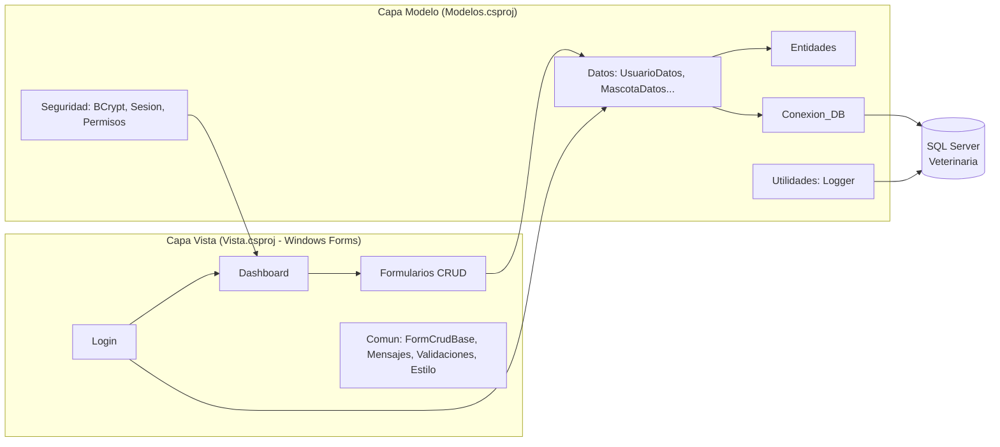
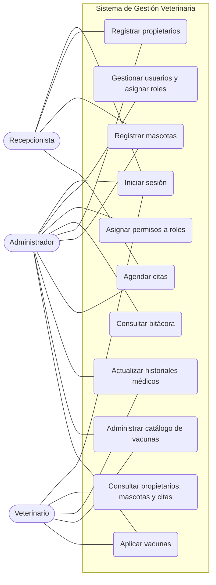
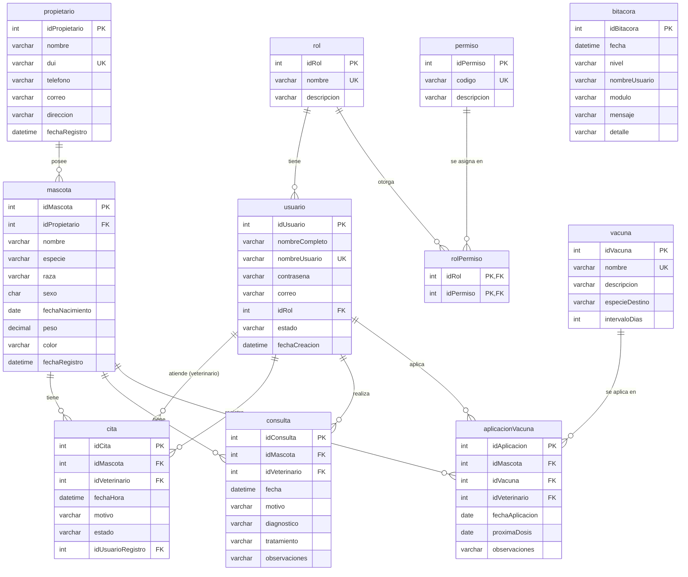

# INSTITUTO TÉCNICO RICALDONE

**Primer Año de Bachillerato, Desarrollo de Software**
**BTVDS-1.3 Diseño de Aplicaciones Multimedia**

---

## PROYECTO DE MÓDULO
## Sistema de Gestión Veterinaria

**Problema 5 — Clínica veterinaria**

Instructor: Emerson González

Integrantes:
1. ______________________________
2. ______________________________
3. ______________________________

Sección técnica: __________  ·  Fecha de entrega: 02/10/2026

## Índice

1. [Introducción](#1-introducción)
2. [Levantamiento de requerimientos](#2-levantamiento-de-requerimientos)
3. [Arquitectura del sistema](#3-arquitectura-del-sistema)
4. [Diagrama de casos de uso](#4-diagrama-de-casos-de-uso)
5. [Diagrama entidad–relación](#5-diagrama-entidadrelación)
6. [Diccionario de datos](#6-diccionario-de-datos)
7. [Seguridad y manejo de excepciones](#7-seguridad-y-manejo-de-excepciones)
8. [Cumplimiento de la rúbrica](#8-cumplimiento-de-la-rúbrica)
9. [Manual rápido de uso](#9-manual-rápido-de-uso)

---

## 1. Introducción

Una clínica veterinaria necesita organizar los expedientes de mascotas, vacunas, propietarios y citas médicas
para optimizar la atención y reemplazar el uso desordenado de archivos físicos.

El **Sistema de Gestión Veterinaria** es una aplicación de escritorio desarrollada en **C# (Windows Forms,
.NET Framework 4.8)** con base de datos **SQL Server**. Aplica una arquitectura **MV (Modelo–Vista)** con
separación de capas, autenticación con contraseñas cifradas mediante **BCrypt.Net**, control de acceso por
**roles y permisos** (Administrador, Veterinario y Recepcionista), operaciones **CRUD** completas, validaciones
de datos, manejo de excepciones con `try/catch` y `MessageBox`, y registro de actividades (*logging*) en archivo
y en la tabla `bitacora`.

**Objetivo general:** digitalizar y centralizar la información clínica de la veterinaria.

**Objetivos específicos:**
- Registrar propietarios y mascotas evitando duplicidad de datos.
- Agendar citas sin conflictos de horario para el veterinario.
- Mantener el historial médico y el control de vacunación de cada mascota.
- Controlar quién puede ver o modificar cada información según su rol.

## 2. Levantamiento de requerimientos

### 2.1 Requerimientos funcionales

| Código | Requerimiento | Rol principal |
|--------|---------------|---------------|
| RF-01 | Iniciar y cerrar sesión validando usuario y contraseña (BCrypt) | Todos |
| RF-02 | CRUD de usuarios con asignación de rol | Administrador |
| RF-03 | Asignar permisos a cada rol desde el sistema | Administrador |
| RF-04 | Consultar la bitácora de actividades y errores | Administrador |
| RF-05 | CRUD de propietarios | Recepcionista, Administrador |
| RF-06 | CRUD de mascotas asociadas a un propietario | Recepcionista, Administrador |
| RF-07 | Agendar, modificar, cancelar y eliminar citas | Recepcionista, Administrador |
| RF-08 | Registrar y actualizar historiales médicos (consultas) | Veterinario, Administrador |
| RF-09 | Administrar el catálogo de vacunas (CRUD) | Veterinario, Administrador |
| RF-10 | Aplicar vacunas a mascotas y calcular próxima dosis | Veterinario, Administrador |
| RF-11 | Consultar propietarios, mascotas y citas (solo lectura) | Veterinario |

### 2.2 Requerimientos no funcionales

| Código | Requerimiento |
|--------|---------------|
| RNF-01 | Arquitectura MV: la Vista no contiene SQL; el Modelo no contiene formularios |
| RNF-02 | Contraseñas almacenadas únicamente como hash BCrypt (factor de costo 11) |
| RNF-03 | Consultas parametrizadas (prevención de inyección SQL) y conexiones liberadas con `using` |
| RNF-04 | Interfaz uniforme: todos los mantenimientos comparten el mismo diseño |
| RNF-05 | Todo error se registra (archivo `Logs/` y tabla `bitacora`) y se informa al usuario con un mensaje claro |
| RNF-06 | Base de datos SQL Server con integridad referencial y restricciones `CHECK`/`UNIQUE` |

### 2.3 Reglas de negocio

- Un usuario inactivo no puede iniciar sesión; tras 3 intentos fallidos el sistema se cierra.
- Un veterinario no puede tener dos citas programadas a la misma fecha y hora.
- Una cita nueva no puede agendarse en el pasado.
- No se puede eliminar un registro con información relacionada (p. ej., un propietario con mascotas).
- Un usuario no puede eliminarse, desactivarse ni cambiarse de rol a sí mismo.
- El rol Administrador siempre conserva los permisos de gestión de usuarios y roles.
- La fecha de aplicación de una vacuna y la fecha de una consulta no pueden ser futuras.

## 3. Arquitectura del sistema

| Carpeta | Responsabilidad |
|---------|-----------------|
| `Modelos/Conexion_DB` | Conexión a SQL Server (cadena en `App.config`) y métodos parametrizados |
| `Modelos/Entidades` | Clases de dominio (Usuario, Propietario, Mascota, Cita, Consulta, Vacuna...) |
| `Modelos/Datos` | Operaciones CRUD por entidad (únicas con SQL) |
| `Modelos/Seguridad` | Cifrado BCrypt, sesión actual y códigos de permisos |
| `Modelos/Utilidades` | `Logger` (archivo + bitácora) |
| `Vista/Comun` | `FormCrudBase`, `Mensajes`, `Validaciones`, `Estilo` |
| `Vista/<Módulo>` | Formularios agrupados por funcionalidad |

## 4. Diagrama de casos de uso

**Descripción de actores**

| Actor | Descripción |
|-------|-------------|
| Administrador | Asigna personal (usuarios y roles) y tiene control general del sistema |
| Veterinario | Actualiza historiales médicos y aplica vacunas; consulta datos de pacientes |
| Recepcionista | Registra propietarios y mascotas y agenda las citas |

## 5. Diagrama entidad–relación

## 6. Diccionario de datos

**rol** — Roles del sistema.

| Campo | Tipo | Nulo | Clave | Descripción |
|-------|------|------|-------|-------------|
| idRol | INT IDENTITY | No | PK | Identificador del rol |
| nombre | VARCHAR(50) | No | UNIQUE | Administrador, Veterinario, Recepcionista |
| descripcion | VARCHAR(200) | Sí | | Descripción de las funciones |

**permiso** — Catálogo de permisos.

| Campo | Tipo | Nulo | Clave | Descripción |
|-------|------|------|-------|-------------|
| idPermiso | INT IDENTITY | No | PK | Identificador |
| codigo | VARCHAR(50) | No | UNIQUE | Código usado por la aplicación (ej. `MASCOTAS_GESTIONAR`) |
| descripcion | VARCHAR(200) | No | | Qué permite hacer |

**rolPermiso** — Permisos asignados a cada rol.

| Campo | Tipo | Nulo | Clave | Descripción |
|-------|------|------|-------|-------------|
| idRol | INT | No | PK, FK → rol | Rol |
| idPermiso | INT | No | PK, FK → permiso | Permiso otorgado |

**usuario** — Personal de la clínica.

| Campo | Tipo | Nulo | Clave | Descripción |
|-------|------|------|-------|-------------|
| idUsuario | INT IDENTITY | No | PK | Identificador |
| nombreCompleto | VARCHAR(150) | No | | Nombre del empleado |
| nombreUsuario | VARCHAR(50) | No | UNIQUE | Usuario de acceso |
| contrasena | VARCHAR(100) | No | | Hash BCrypt de la contraseña |
| correo | VARCHAR(150) | Sí | | Correo electrónico |
| idRol | INT | No | FK → rol | Rol asignado |
| estado | VARCHAR(20) | No | CHECK | Activo / Inactivo |
| fechaCreacion | DATETIME | No | | Fecha de alta |

**propietario** — Dueños de mascotas.

| Campo | Tipo | Nulo | Clave | Descripción |
|-------|------|------|-------|-------------|
| idPropietario | INT IDENTITY | No | PK | Identificador |
| nombre | VARCHAR(150) | No | | Nombre completo |
| dui | VARCHAR(10) | No | UNIQUE | DUI (formato 00000000-0) |
| telefono | VARCHAR(15) | No | | Teléfono de contacto |
| correo | VARCHAR(150) | Sí | | Correo electrónico |
| direccion | VARCHAR(250) | Sí | | Dirección |
| fechaRegistro | DATETIME | No | | Fecha de registro |

**mascota** — Pacientes de la clínica.

| Campo | Tipo | Nulo | Clave | Descripción |
|-------|------|------|-------|-------------|
| idMascota | INT IDENTITY | No | PK | Identificador |
| idPropietario | INT | No | FK → propietario | Dueño |
| nombre | VARCHAR(100) | No | | Nombre de la mascota |
| especie | VARCHAR(50) | No | | Perro, gato, etc. |
| raza | VARCHAR(80) | Sí | | Raza |
| sexo | CHAR(1) | No | CHECK | M (macho) / H (hembra) |
| fechaNacimiento | DATE | Sí | | Fecha de nacimiento |
| peso | DECIMAL(6,2) | Sí | CHECK > 0 | Peso en kg |
| color | VARCHAR(50) | Sí | | Color |
| fechaRegistro | DATETIME | No | | Fecha de registro |

**vacuna** — Catálogo de vacunas.

| Campo | Tipo | Nulo | Clave | Descripción |
|-------|------|------|-------|-------------|
| idVacuna | INT IDENTITY | No | PK | Identificador |
| nombre | VARCHAR(100) | No | UNIQUE | Nombre de la vacuna |
| descripcion | VARCHAR(250) | Sí | | Descripción |
| especieDestino | VARCHAR(50) | No | | Especie a la que se aplica |
| intervaloDias | INT | No | CHECK > 0 | Días entre dosis (refuerzo) |

**cita** — Citas médicas.

| Campo | Tipo | Nulo | Clave | Descripción |
|-------|------|------|-------|-------------|
| idCita | INT IDENTITY | No | PK | Identificador |
| idMascota | INT | No | FK → mascota | Paciente |
| idVeterinario | INT | No | FK → usuario | Veterinario asignado |
| fechaHora | DATETIME | No | | Fecha y hora de la cita |
| motivo | VARCHAR(250) | No | | Motivo de la consulta |
| estado | VARCHAR(20) | No | CHECK | Programada / Atendida / Cancelada |
| idUsuarioRegistro | INT | No | FK → usuario | Quién agendó la cita |

**consulta** — Historial médico.

| Campo | Tipo | Nulo | Clave | Descripción |
|-------|------|------|-------|-------------|
| idConsulta | INT IDENTITY | No | PK | Identificador |
| idMascota | INT | No | FK → mascota | Paciente |
| idVeterinario | INT | No | FK → usuario | Veterinario que atendió |
| fecha | DATETIME | No | | Fecha de la consulta |
| motivo | VARCHAR(250) | No | | Motivo |
| diagnostico | VARCHAR(500) | No | | Diagnóstico |
| tratamiento | VARCHAR(500) | Sí | | Tratamiento indicado |
| observaciones | VARCHAR(500) | Sí | | Observaciones |

**aplicacionVacuna** — Vacunas aplicadas.

| Campo | Tipo | Nulo | Clave | Descripción |
|-------|------|------|-------|-------------|
| idAplicacion | INT IDENTITY | No | PK | Identificador |
| idMascota | INT | No | FK → mascota | Paciente |
| idVacuna | INT | No | FK → vacuna | Vacuna aplicada |
| idVeterinario | INT | No | FK → usuario | Quien la aplicó |
| fechaAplicacion | DATE | No | | Fecha de aplicación |
| proximaDosis | DATE | Sí | | Fecha del refuerzo |
| observaciones | VARCHAR(250) | Sí | | Observaciones |

**bitacora** — Registro de actividades y errores.

| Campo | Tipo | Nulo | Clave | Descripción |
|-------|------|------|-------|-------------|
| idBitacora | INT IDENTITY | No | PK | Identificador |
| fecha | DATETIME | No | | Fecha y hora del evento |
| nivel | VARCHAR(10) | No | | INFO / ERROR |
| nombreUsuario | VARCHAR(50) | Sí | | Usuario que generó el evento |
| modulo | VARCHAR(50) | No | | Módulo del sistema |
| mensaje | VARCHAR(500) | No | | Descripción del evento |
| detalle | VARCHAR(MAX) | Sí | | Traza de la excepción |

## 7. Seguridad y manejo de excepciones

- **Cifrado:** `Modelos/Seguridad/EncriptadorContrasena.cs` usa `BCrypt.Net.BCrypt.HashPassword` y `Verify`.
  La base de datos nunca contiene contraseñas en texto plano.
- **Autorización:** al iniciar sesión se cargan los permisos del rol en `Sesion`. El menú solo muestra los
  módulos permitidos y los botones Nuevo/Guardar/Eliminar se deshabilitan si falta el permiso `*_GESTIONAR`.
- **Inyección SQL:** todas las consultas usan `SqlParameter`.
- **Excepciones:** cada acción de la Vista está protegida con `try/catch`. `Mensajes.Error` traduce los códigos de
  `SqlException` (duplicados 2627/2601, integridad referencial 547, servidor inaccesible 53, BD inexistente 4060,
  login 18456) a mensajes comprensibles en un `MessageBox`, y `Logger.Error` guarda el detalle en
  `Logs/veterinaria_AAAAMMDD.log` y en la tabla `bitacora`. Una última red de seguridad en `Program.cs`
  captura excepciones no controladas.
- **Logging de actividades:** inicio/cierre de sesión, intentos fallidos y cada alta, modificación o baja.

## 8. Cumplimiento de la rúbrica

| # | Criterio | Dónde se cumple |
|---|----------|-----------------|
| 1 | Arquitectura MV | Proyectos `Modelos` y `Vista`; la Vista solo invoca clases de `Modelos.Datos` |
| 2 | Estructura de carpetas | Capas por proyecto y carpetas por funcionalidad (ver sección 3) |
| 3 | Login con BCrypt | `Vista/Login/frmLogin.cs`, `UsuarioDatos.Autenticar`, `EncriptadorContrasena` |
| 4 | Gestión de usuarios | `Vista/Usuarios/frmUsuarios.cs` (CRUD + rol) |
| 5 | Roles y permisos | Tablas `rol`/`permiso`/`rolPermiso`, `Sesion.Tiene`, `frmRoles` |
| 6 | Seguridad | Hash BCrypt, consultas parametrizadas, reglas anti-bloqueo |
| 7 | Scripts de BD | `BaseDatos/Veterinaria.sql` (comentado, con usuarios, roles y permisos) |
| 8 | CRUD de todas las entidades | Propietarios, Mascotas, Citas, Consultas, Vacunas, Aplicaciones, Usuarios |
| 9 | Excepciones | `try/catch` + `MessageBox` + `Logger` |
| 10 | Interfaz de usuario | `FormCrudBase` unifica diseño; mensajes de validación claros |
| 11 | Conexión a BD | `Conexion_DB/Conexion.cs` (cadena en `App.config`, `using`, parámetros) |
| 12 | Documentación | Este documento |

## 9. Manual rápido de uso

1. Ejecutar `BaseDatos/Veterinaria.sql` y abrir `Veterinaria.sln`.
2. Ingresar con `admin / Admin123*`, `dvera / Vet12345*` o `recep1 / Recep123*`.
3. **Recepcionista:** Propietarios → Mascotas → Citas.
4. **Veterinario:** Consultas médicas (historial) y Vacunas (aplicar y administrar catálogo).
5. **Administrador:** Usuarios (crear personal y asignar rol), Roles y permisos, Bitácora y todos los módulos.
