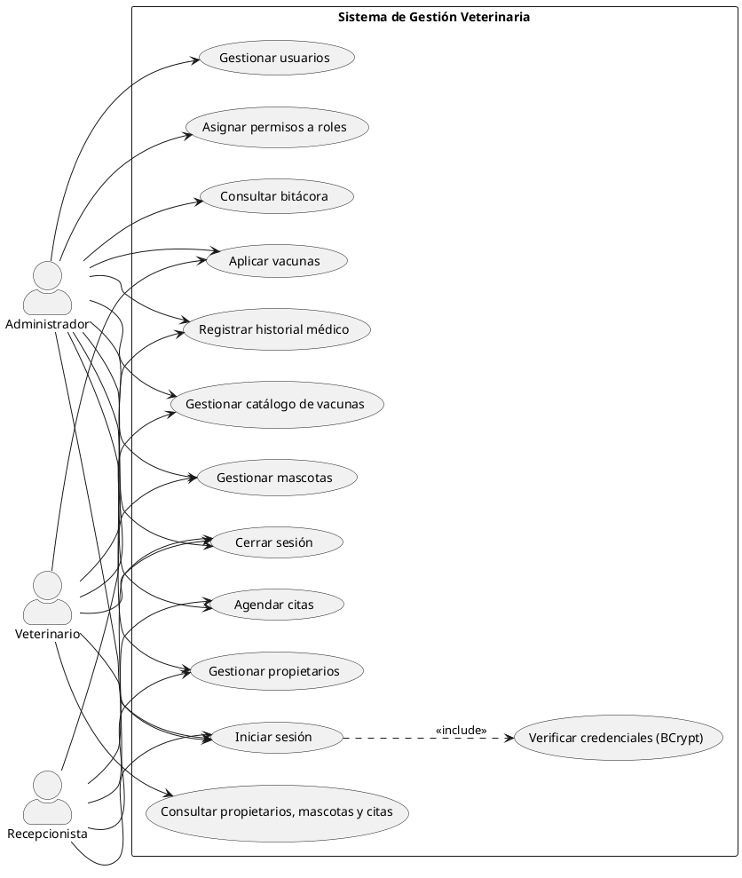
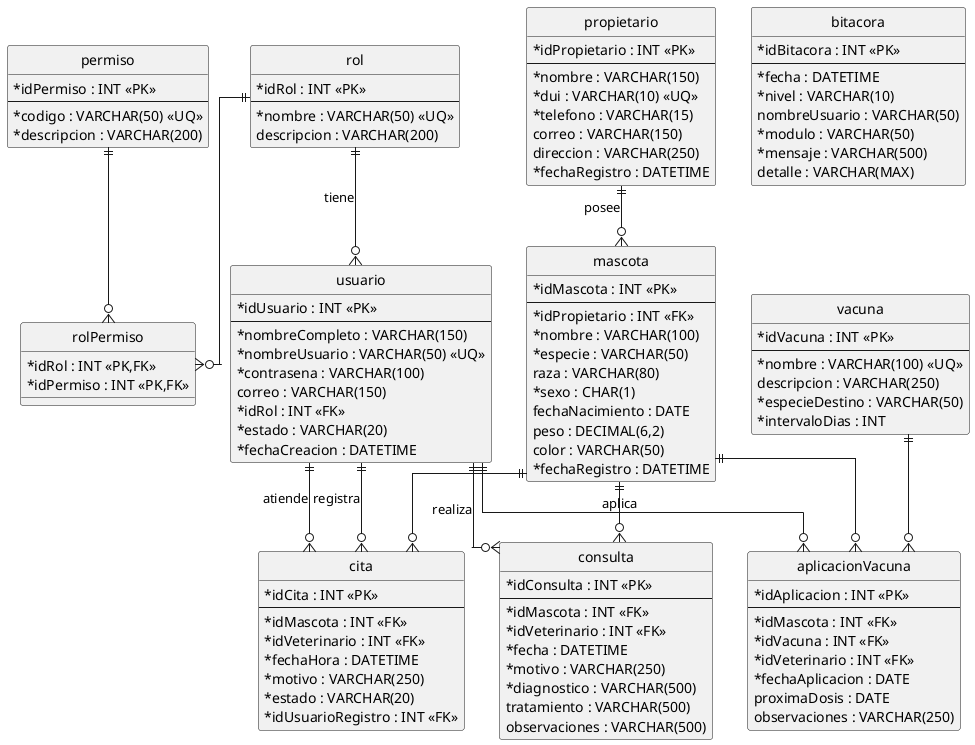
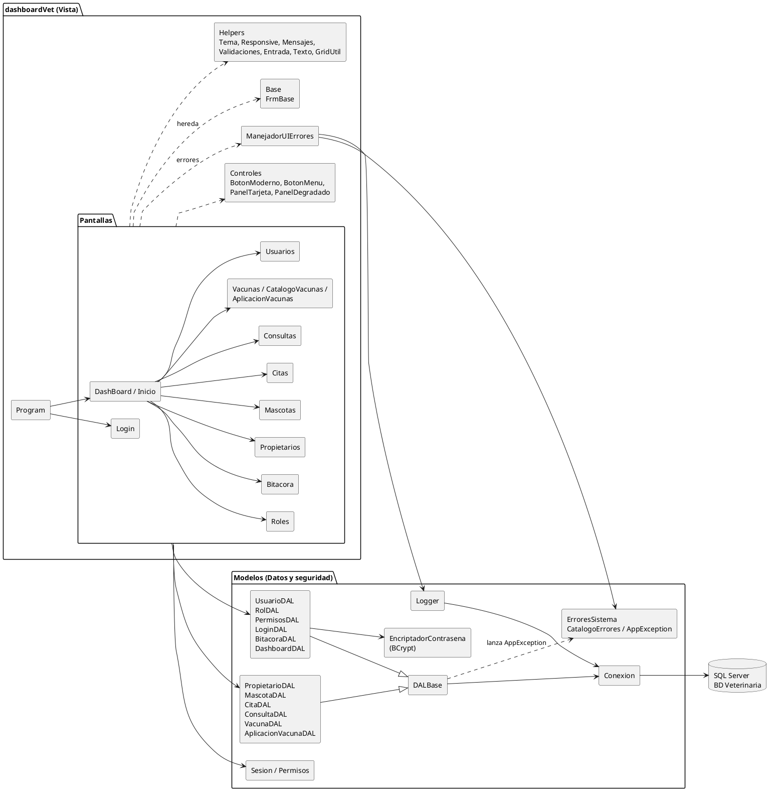

# Código PlantUML de los diagramas

Pegue cada bloque en https://www.plantuml.com/plantuml o en la extensión PlantUML de Visual Studio Code, o abra los archivos `.puml` de esta carpeta.

## 01_casos_de_uso.puml

## 02_entidad_relacion.puml

## 03_arquitectura.puml

## 04_clases_modelos.puml

```plantuml
@startuml clases_modelos
skinparam classAttributeIconSize 0

abstract class DALBase {
  #_conexion : Conexion
  #P(nombre, valor) : SqlParameter
  #Like(nombre, filtro) : SqlParameter
  #Traducir(ex) : Exception
  #Consultar(sql, parametros) : DataTable
  #Ejecutar(sql, parametros) : int
  #Escalar(sql, parametros) : object
  #Existe(sql, parametros) : bool
}

class Conexion {
  +ObtenerConexion() : SqlConnection
}

class ErrorInfo {
  +Codigo : string
  +MensajeUsuario : string
  +DescripcionTecnica : string
}

class CatalogoErrores <<static>> {
  +Obtener(codigo) : ErrorInfo
  +MapearSqlException(numero) : string
}

class AppException {
  +CodigoError : string
  +DetalleError : ErrorInfo
}

class PropietarioDAL {
  +Listar(filtro) : DataTable
  +ExisteDui(dui, idExcluir) : bool
  +Insertar(...)
  +Actualizar(...)
  +Eliminar(idPropietario)
}

class MascotaDAL {
  +Listar(filtro) : DataTable
  +ListarParaCombo() : DataTable
  +ExisteNombreEnPropietario(...) : bool
  +ObtenerBasico(idMascota) : DataRow
  +Insertar(...)
  +Actualizar(...)
  +Eliminar(idMascota)
}

class CitaDAL {
  +Listar(filtro) : DataTable
  +VeterinarioOcupado(...) : bool
  +MascotaTieneCitaEseDia(...) : bool
  +Insertar(...)
  +Actualizar(...)
  +Eliminar(idCita)
}

class ConsultaDAL {
  +Listar(filtro) : DataTable
  +Insertar(...)
  +Actualizar(...)
  +Eliminar(idConsulta)
}

class VacunaDAL {
  +Listar(filtro) : DataTable
  +ListarParaCombo() : DataTable
  +ExisteNombre(nombre, idExcluir) : bool
  +ObtenerEspecieDestino(idVacuna) : string
  +Insertar(...)
  +Actualizar(...)
  +Eliminar(idVacuna)
}

class AplicacionVacunaDAL {
  +Listar(filtro) : DataTable
  +ExisteAplicacion(...) : bool
  +Insertar(...)
  +Actualizar(...)
  +Eliminar(idAplicacion)
}

class UsuarioDAL {
  +Listar(filtro) : DataTable
  +ListarVeterinarios() : DataTable
  +ExisteNombreUsuario(...) : bool
  +ExisteCorreo(...) : bool
  +Insertar(...)
  +Actualizar(...)
  +Eliminar(idUsuario)
}

class RolDAL {
  +Listar() : DataTable
}

class PermisosDAL {
  +Listar() : DataTable
  +PermisosDeRol(idRol) : HashSet<int>
  +Guardar(idRol, nombreRol, ids, codigos)
}

class LoginDAL {
  +Autenticar(usuario, contrasena) : UsuarioSesion
}

class BitacoraDAL {
  +Listar(nivel, filtro) : DataTable
}

class DashboardDAL {
  +Resumen() : DataRow
  +ProximasCitas() : DataTable
}

class UsuarioSesion {
  +IdUsuario : int
  +NombreCompleto : string
  +NombreUsuario : string
  +Correo : string
  +IdRol : int
  +Rol : string
  +Estado : string
  +Permisos : HashSet<string>
}

class Sesion <<static>> {
  +UsuarioActual : UsuarioSesion
  +Iniciar(usuario)
  +Cerrar()
  +Tiene(codigoPermiso) : bool
}

class EncriptadorContrasena <<static>> {
  +Hashear(contrasena) : string
  +Verificar(contrasena, hash) : bool
}

class Logger <<static>> {
  +Info(modulo, mensaje)
  +Error(modulo, ex)
}

DALBase <|-- PropietarioDAL
DALBase <|-- MascotaDAL
DALBase <|-- CitaDAL
DALBase <|-- ConsultaDAL
DALBase <|-- VacunaDAL
DALBase <|-- AplicacionVacunaDAL
DALBase <|-- UsuarioDAL
DALBase <|-- RolDAL
DALBase <|-- PermisosDAL
DALBase <|-- LoginDAL
DALBase <|-- BitacoraDAL
DALBase <|-- DashboardDAL
DALBase --> Conexion
DALBase ..> AppException : lanza
CatalogoErrores --> ErrorInfo
AppException --> ErrorInfo
LoginDAL ..> UsuarioSesion : crea
LoginDAL ..> EncriptadorContrasena
UsuarioDAL ..> EncriptadorContrasena
Sesion o-- UsuarioSesion
Logger ..> Conexion
@enduml
```

